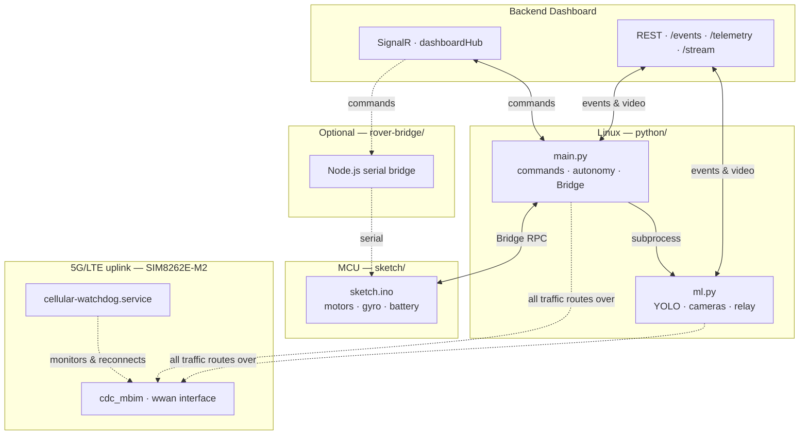

<div align="center">

# Castel

**Autonomous rover stack for Sânzi — motors, vision, and cloud dashboard in one app.**

*Remote control · person detection · live video · autonomous approach · 5G/LTE uplink*

*To connect to the rover use the address: arduino@192.168.1.236 password: 0012345G*

</div>

---

## Overview

**Castel** is an Arduino App that turns a dual-camera rover into a connected field robot. It bridges low-level motor control on the MCU with computer vision and a cloud dashboard on the Linux side of Sânzi, reaching the internet over a SIMCom SIM8262E-M2 5G/LTE modem rather than WiFi.

| Mode | What it does |
|------|--------------|
| **Manual** | Drive from the dashboard via SignalR - forward, turn, arc, stop |
| **Autonomous** | Scan for people with YOLO, approach with pulsed movement, report alerts |
| **Telemetry** | Battery level and detection events streamed to the backend |

> **Safety note:** There is no obstacle or distance sensor by default. Autonomous mode relies on camera detections only. Always test supervised, in open space, with Manual mode one command away.

---

## Architecture



---

## Connectivity: 5G/LTE setup (SIM8262E-M2)

The rover reaches the internet over a SIMCom SIM8262E-M2 module rather than WiFi, so it can operate untethered in the field. Getting a real kernel-level network interface out of this module on the UNO Q's stock image took real work, documented here so it isn't lost:

### What we found
- The UNO Q's shipped kernel (`7.0.0-g122c2c22d838`) has **no built-in driver support** for any of the standard ways Linux talks to USB cellular modems: `qmi_wwan`, `rndis_host`, `cdc_mbim`, and even `ppp_generic` are all absent.
- The module defaults to a plain AT/serial USB composition (`option` driver, `1e0e:9001`) - useful for AT commands, but gives no IP-routable network interface on its own.
- **RNDIS composition** (`1e0e:9011`) was tried first, since it's the module's documented default dial-up mode. It required building `rndis_host`/`usbnet`/`cdc_ether` from source, but the module's actual RNDIS descriptor implementation didn't match what `rndis_host`'s bind logic expects (`bad CDC descriptors` - a real vendor-implementation quirk, not a config error), so it never bound.
- **MBIM composition** (`1e0e:9003`) was the fix. MBIM is a tighter USB-IF standard than RNDIS and bound cleanly once `cdc_mbim`/`cdc_ncm`/`cdc-wdm` were built and loaded, producing a real `wwan`-class interface (`wwu1u4u4i5` on this board).

### How the kernel modules were built
Since the running kernel had no matching prebuilt modules, they were cross-compiled from Arduino's own kernel source (`github.com/arduino/linux-qcom`), checked out at the exact commit embedded in the running kernel's version string (`122c2c22d838`), using the board's exact running `.config` (`/proc/config.gz`) and a Debian trixie container to match the board's exact GCC version (`14.2.0-19`) bit-for-bit - a mismatched toolchain produces modules the kernel silently rejects (`Invalid module format` / vermagic mismatch).

Built and installed:
- `cdc-wdm.ko` (MBIM control channel)
- `usbnet.ko`, `cdc_ncm.ko`, `cdc_mbim.ko` (the actual network driver stack)

These are installed into `/lib/modules/$(uname -r)/kernel/drivers/...`, indexed with `depmod -a`, and set to autoload at boot via `/etc/modules-load.d/cellular.conf` - no manual `insmod` needed after a reboot.

### Switching the modem into MBIM mode
The module's USB composition is changed with an AT command, then a reboot of the modem's own baseband (not the board):
```
AT+CUSBCFG=usbid,1e0e,9003
AT+CFUN=1,1
```
This is a **persistent** setting on the module (survives power cycles) but was observed to occasionally revert to the default `9001` composition after a hard reset - if `lsusb | grep 1e0e` ever shows `9001` instead of `9003`, re-run the above.

### Connection management: ModemManager + `cellular-watchdog.service`
`ModemManager` handles registration and the MBIM data session (APN `m2m.orange.ro`, static IPv4). Because this is a real mobile connection - subject to signal fades, tower handovers, and the occasional dropped bearer - a small systemd service, **`cellular-watchdog.service`**, runs continuously and:
1. Checks the modem's real state via `mmcli` every 15 seconds.
2. Actually pings out (not just trusting ModemManager's reported state) to verify the connection is genuinely working end-to-end.
3. Requires **two consecutive** failed checks before acting, so a single bad-latency moment doesn't trigger an unnecessary reconnect (an earlier, more aggressive version of this script was found to be the *cause* of dropped SignalR sessions, by tearing down the interface's IP config too eagerly).
4. On a confirmed failure, reconnects the bearer and reapplies IP/gateway/DNS automatically - the same manual `mmcli --simple-connect` + `ip addr`/`ip route` sequence used during setup, now automated.

Install: copy `cellular_watchdog.py` and `cellular-watchdog.service` to the board, then
```bash
sudo cp cellular-watchdog.service /etc/systemd/system/
sudo systemctl daemon-reload
sudo systemctl enable --now cellular-watchdog.service
```
Watch it live with `sudo journalctl -u cellular-watchdog.service -f`.

### Known limitation: camera bandwidth vs. control channel
The cellular uplink is far narrower than the module's downlink, and early testing showed the camera relay (two cameras pushing JPEG frames + alert images) could saturate it badly enough to starve the SignalR control channel of bandwidth - manifesting as the rover intermittently stopping responding to dashboard commands for longer than a normal reconnect should take. Confirmed by disabling the camera pipeline (`START_ML=0`) and observing rock-solid control with zero drops.

Fix, applied in `ml.py`:
- All outbound HTTP requests from **both** cameras (video relay, alert POST, alert image upload) are now serialized through one global lock, so only one request is ever in flight to the backend at a time - concurrent requests fighting for the same narrow uplink were worse than the same total traffic sent sequentially.
- Default `JPEG_QUALITY` lowered (70 → 35), `ALERT_JPEG_QUALITY` lowered (85 → 55), `PUSH_FPS` lowered (5 → 1).
- Request timeouts widened to tolerate this connection's real latency profile (single-digit-second spikes are normal, not a fault).

Camera video is **not yet confirmed working end-to-end** over cellular even with these changes - that remains open. Control reliability, which was the more urgent issue, is resolved.

---

## Project structure

```
castel/
├── app.yaml                 # Arduino App metadata
├── sketch/                  # Firmware — motor driver, MPU6050, Bridge API
│   ├── sketch.ino
│   ├── motordriver.cpp
│   └── motordriver.h
├── python/                  # Linux-side application
│   ├── main.py               # Dashboard link, autonomy, motor orchestration
│   ├── ml.py                 # Dual-camera YOLO pipeline & local HTTP API
│   ├── requirements.txt
│   └── yolo26n_img480_int8.onnx
├── rover-bridge/             # Alternative: SignalR → serial on a companion PC
│   ├── bridge.js
│   └── package.json
└── cellular/                 # 5G/LTE connectivity (see "Connectivity" above)
    ├── cellular_watchdog.py
    └── cellular-watchdog.service
```

---

## Features

<table>
<tr>
<td width="50%">

### Remote control
- SignalR connection to `dashboardHub`
- Latest-state-wins command handling with watchdog stop
- Manual / Autonomous mode switching from the dashboard
- Immediate motor-stop on any transport-level disconnect (`on_hub_error`/`on_hub_closed`), with disconnect→reconnect downtime logged in seconds

</td>
<td width="50%">

### Computer vision
- YOLO person detection via **ONNX Runtime** (no PyTorch on-device)
- Two cameras, each with its own local HTTP server
- Annotated MJPEG relay to the backend, bandwidth-tuned for a cellular uplink

</td>
</tr>
<tr>
<td width="50%">

### Autonomy
- **Scan** → rotate and search for people
- **Approach** → center and move forward in short pulses
- **Hold** → stop, report `PERSON_REACHED`, cooldown before resuming

</td>
<td width="50%">

### Hardware integration
- Soft-start PWM ramping to reduce brownouts
- MPU6050 gyro for turn-by-degrees (optional)
- Battery voltage divider telemetry over REST (currently disabled - backend `/telemetry` endpoint not yet deployed)
- 5G/LTE uplink with automatic reconnection (see "Connectivity" above)

</td>
</tr>
</table>

---

## Quick start

### Prerequisites

- Arduino App Lab with CLI
- Sânzi
- Two V4L2 cameras
- SIM8262E-M2 module with an active M2M SIM, in MBIM composition (see "Connectivity")
- Backend dashboard reachable over the network

### Run the app

```bash
arduino-app-cli app start ~/path/to/castel
```

This launches `python/main.py`, which in turn starts `ml.py` as a child process — one command brings up motors and cameras together.

### Environment variables

| Variable | Default | Description |
|----------|---------|-------------|
| `API_BASE` | `http://92.87.91.146:5000` | Backend URL |
| `ROVER_ID` | `ROVER-Q1` | Rover identity for SignalR groups |
| `CAM1_PORT` / `CAM2_PORT` | `8081` / `8082` | Per-camera local API ports |
| `CAM1_DEVICE` / `CAM2_DEVICE` | `/dev/v4l/by-path/...` | V4L2 device paths (confirmed stable across reboots, unlike raw indices on this board) |
| `START_ML` | `1` | Set to `0` to run the ML pipeline manually, or to isolate control-channel issues from camera traffic |
| `PUSH_FPS` | `1` | Camera relay push rate - tuned down for cellular; raise only if uplink headroom allows |
| `JPEG_QUALITY` | `35` | Video relay JPEG quality - tuned down for cellular |
| `ALERT_JPEG_QUALITY` | `55` | Alert snapshot JPEG quality |

### Optional: companion-computer bridge

If Sânzi is connected to a separate host instead of running the full app on-board:

```bash
cd rover-bridge
npm install
BACKEND_URL=http://your-backend:5000 ROVER_ID=ROVER-Q1 SERIAL_PORT=/dev/ttyACM0 npm start
```

---

## Local camera API

Each camera exposes its own server (defaults **8081** / **8082**):

| Endpoint | Returns |
|----------|---------|
| `GET /` | Camera info and endpoint list |
| `GET /api/detections` | Latest person detections (JSON) |
| `GET /snapshot` | Annotated JPEG frame |
| `GET /video_feed` | MJPEG stream |

---

## Python dependencies

```bash
pip install -r python/requirements.txt
```

Core packages: `signalrcore`, `requests`, `numpy`, `opencv-python-headless`, `onnxruntime`.

---

## Firmware notes

- Motor commands are exposed through **Arduino Router Bridge** (`cmd_forward`, `cmd_stop`, etc.).
- PWM is soft-ramped to limit inrush current; `MAX_SAFE_PWM` caps top speed until hardware is validated.
- Set `HAS_ULTRASONIC` to `1` in `sketch.ino` once an HC-SR04 is wired for distance sensing.

---

## Known open items

- Camera video relay over cellular is bandwidth-tuned but not yet confirmed reliably working end-to-end - control-channel reliability was prioritized and resolved first.
- Backend `/telemetry` endpoint returns 404 - not yet deployed. `ENABLE_TELEMETRY` is set to `False` until confirmed.
- MBIM USB composition (`AT+CUSBCFG=usbid,1e0e,9003`) has been observed to revert to the module's default (`9001`) after some hard resets - not yet automated; check `lsusb | grep 1e0e` after any full power cycle.

---

<div align="center">

<sub>Castel</sub>

</div>
