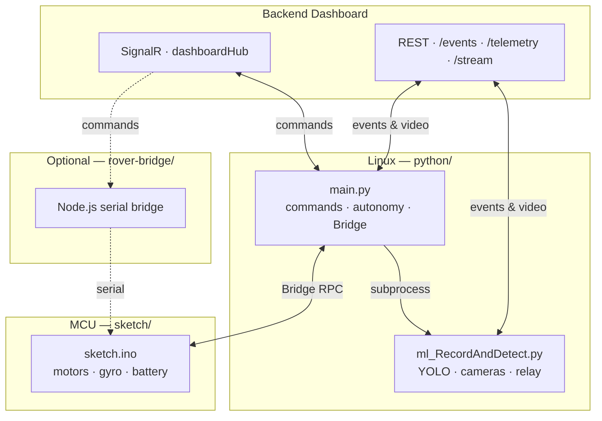

<div align="center">

# Castel

**Autonomous rover stack for Sânzi — motors, vision, and cloud dashboard in one app.**

*Remote control · person detection · live video · autonomous approach*

</div>

---

## Overview

**Castel** is an Arduino App that turns a dual-camera rover into a connected field robot. It bridges low-level motor control on the MCU with computer vision and a cloud dashboard on the Linux side of Sânzi.

| Mode | What it does |
|------|--------------|
| **Manual** | Drive from the dashboard via SignalR - forward, turn, arc, stop |
| **Autonomous** | Scan for people with YOLO, approach with pulsed movement, report alerts |
| **Telemetry** | Battery level and detection events streamed to the backend |

> **Safety note:** There is no obstacle or distance sensor by default. Autonomous mode relies on camera detections only. Always test supervised, in open space, with Manual mode one command away.

---

## Architecture



---

## Project structure

```
castel/
├── app.yaml                 # Arduino App metadata
├── sketch/                  # Firmware — motor driver, MPU6050, Bridge API
│   ├── sketch.ino
│   ├── motordriver.cpp
│   └── motordriver.h
├── python/                  # Linux-side application
│   ├── main.py              # Dashboard link, autonomy, motor orchestration
│   ├── ml_RecordAndDetect.py # Dual-camera YOLO pipeline & local HTTP API
│   ├── requirements.txt
│   └── yolo26n_img480_int8.onnx
└── rover-bridge/            # Alternative: SignalR → serial on a companion PC
    ├── bridge.js
    └── package.json
```

---

## Features

<table>
<tr>
<td width="50%">

### Remote control
- SignalR connection to `dashboardHub`
- Latest-state-wins command handling with watchdog stop
- Manual / Autonomous mode switching from the dashboard

</td>
<td width="50%">

### Computer vision
- YOLO person detection via **ONNX Runtime** (no PyTorch on-device)
- Two cameras, each with its own local HTTP server
- Annotated MJPEG relay to the backend

</td>
</tr>
<tr>
<td width="50%">

### Autonomy
- **Scan** → rotate and search for people
- **Approach** → center and move forward in short pulses
- **Hold** → stop, report `PERSON_REACHED`, cooldown before resuming

</td>
<td width="50%">

### Hardware integration
- Soft-start PWM ramping to reduce brownouts
- MPU6050 gyro for turn-by-degrees (optional)
- Battery voltage divider telemetry over REST

</td>
</tr>
</table>

---

## Quick start

### Prerequisites

- Arduino App Lab with CLI
- Sânzi
- Two V4L2 cameras
- Backend dashboard reachable over the network

### Run the app

```bash
arduino-app-cli app start ~/path/to/castel
```

This launches `python/main.py`, which in turn starts `ml_RecordAndDetect.py` as a child process — one command brings up motors and cameras together.

### Environment variables

| Variable | Default | Description |
|----------|---------|-------------|
| `API_BASE` | `http://92.87.91.146:5000` | Backend URL |
| `ROVER_ID` | `ROVER-Q1` | Rover identity for SignalR groups |
| `CAM1_PORT` / `CAM2_PORT` | `8081` / `8082` | Per-camera local API ports |
| `CAM1_DEVICE` / `CAM2_DEVICE` | `2` / `0` | V4L2 device indices |
| `START_ML` | `1` | Set to `0` to run the ML pipeline manually |

### Optional: companion-computer bridge

If Sânzi is connected to a separate host instead of running the full app on-board:

```bash
cd rover-bridge
npm install
BACKEND_URL=http://your-backend:5000 ROVER_ID=ROVER-Q1 SERIAL_PORT=/dev/ttyACM0 npm start
```

---

## Local camera API

Each camera exposes its own server (defaults **8081** / **8082**):

| Endpoint | Returns |
|----------|---------|
| `GET /` | Camera info and endpoint list |
| `GET /api/detections` | Latest person detections (JSON) |
| `GET /snapshot` | Annotated JPEG frame |
| `GET /video_feed` | MJPEG stream |

---

## Python dependencies

```bash
pip install -r python/requirements.txt
```

Core packages: `signalrcore`, `requests`, `numpy`, `opencv-python-headless`, `onnxruntime`.

---

## Firmware notes

- Motor commands are exposed through **Arduino Router Bridge** (`cmd_forward`, `cmd_stop`, etc.).
- PWM is soft-ramped to limit inrush current; `MAX_SAFE_PWM` caps top speed until hardware is validated.
- Set `HAS_ULTRASONIC` to `1` in `sketch.ino` once an HC-SR04 is wired for distance sensing.

---

<div align="center">

<sub>Castel</sub>

</div>
